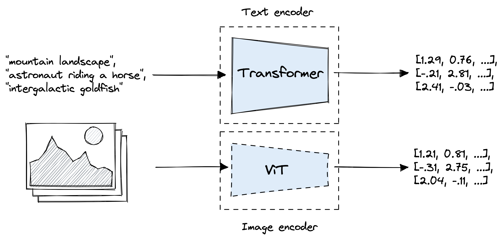
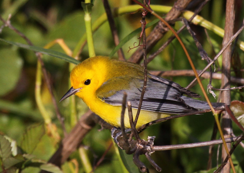

# Natural Language Bird Search

For my project I have created an application designed to assist bird watcher in identifying bird species through natural language descriptions or upload images. I achieved this by fine-tuning a clip embedding model (`openai/clip-vit-base-patch32`) on the `CUB-200-2011` dataset.

## Demo & Presentation


[Presentation Video & Demo](https://youtu.be/CVYOU6NjTWg?si=OBSGZowQa0nBBdOV)

## The Problem

Traditional image search relies on manually tagging images with relevant description, features and class. Doing this process by hand difficult and error prone and largely defeats the purpose of identifying an unknown bird species. You may think to use a traditional classifier to automate the process of creating tags. However this approach still has several flaws the main ones being. Tag based search lacks relations ship between words for example a sentence containing `red head` and `grey wing` could become confused and result in images of birds with a grey head and red wings. Additionally tag based searching lacks the ability to search by image which is an essential feature for identifying birds. A Clip based approach solves this issue by encoding the image and the query into an internal image embedding space. These embeddings (image or text) can then simply be compared using cosine similarity to find the most similar images. 

### Architecture & Training Details

I used `openai/clip-vit-base-patch32` as the base model and fine-tune it with the `CUB-200-2011` dataset

**Model**: 

The `openai/clip-vit-base-patch32` consists of an text encoder (`transformer`) and image encoder (`ViT`) which are trained to have a shared embedding space. Open AI inital trained this model using 
\> 400 million Image prompt pairs in 2021



**Dataset**: 

The dataset used is the `CUB-200-2011` dataset. It contains `11,788` images of birds from across `200` classes each image is tagged with a number of attributes (examples below). The data is spread across a number of files which needed to be merged before it can be used for fine tuning.

```
Sample Bird:
  Class: Yellow Warbler
  Attributes: leg color buff, forehead color grey, crown color yellow, primary color yellow, back color grey, breast color grey, size small (5 - 9 in)
  Prompt: Yellow Warbler with leg color buff, forehead color grey, crown color yellow, primary color yellow, back color grey, breast color grey, size small (5 - 9 in)

```


```bash
 attributes.txt
└──  CUB_200_2011
    ├──  attributes
    │   ├──  certainties.txt
    │   ├──  class_attribute_labels_continuous.txt
    │   └──  image_attribute_labels.txt
    ├──  bounding_boxes.txt
    ├──  classes.txt
    ├──  image_class_labels.txt
    ├──  images
    │   ├──  001.Black_footed_Albatross
    │   ├──  002.Laysan_Albatross
    │   ├──  003.Sooty_Albatross
    │   .          ...
    ├──  images.txt
    ├──  parts
    │   ├──  part_click_locs.txt
    │   ├──  part_locs.txt
    │   └──  parts.txt
    ├──  README
    └──  train_test_split.txt
```

**Fine tuning**:

This model is used as a base model to begin fine tuning. The process of fine tuning started by generating a prompt using the class names and the image attributes from the dataset

```
"a photo of a {class_name} with {attrs}"
"{class_name} with {attrs}"
"a {class_name}, has {attrs}"
"{class_name}, {attrs}"
```

The fine tuning process included processing the images (cropping, resizing down, flattening) and processing the prompt (padding/shortening, tokenization, initial embedding). these pairs where then used as training examples. the model was trained from 5 epochs at learning rate of 5e-6.

## Application Pipeline

The training was complete a head of time using the jupyter notebook and the model weight were saved. These weights are then loaded by the flask server at startup. The flask provides an endpoint to servers the static web app and a endpoints to search.
 
1. User enters a query or an image
2. Front end sends a request to flask endpoint
3. Flask server receives the query/image and generates an embedding
4. Using the embedding the server calculate a similarity between all existing images embeddings (generated in notebook at train time) using cosine similarity
5. It then returns the top n images to the frontend
6. The front end then displays the images
 
## Deployment

The application is intended to be deployed locally by following the steps below and then visiting `localhost:10000`. The final model runs sufficiently fast even with only a cpu.

```bash
git clone https://github.com/Jordan-Brown15/natural-bird-search.git
cd natural-bird-search

pip install -r requirements.txt

cd app
python app.py
```

## References

- Radford, A., Kim, J. W., Hallacy, C., Ramesh, A., Goh, G., Agarwal, S., ... & Sastry, G. (2021). Learning Transferable Visual Models From Natural Language Supervision. *International Conference on Machine Learning (ICML)*, 8748-8763. https://arxiv.org/abs/2103.00020

- Wah, C., Branson, S., Welinder, P., Perona, P., & Belongie, S. (2011). The Caltech-UCSD Birds-200-2011 Dataset. *California Institute of Technology*. https://www.vision.caltech.edu/datasets/cub_200_2011/